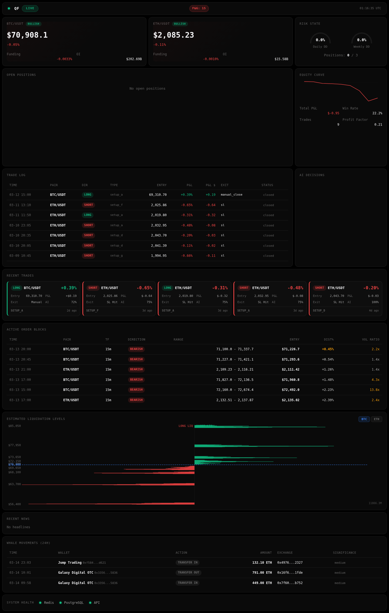
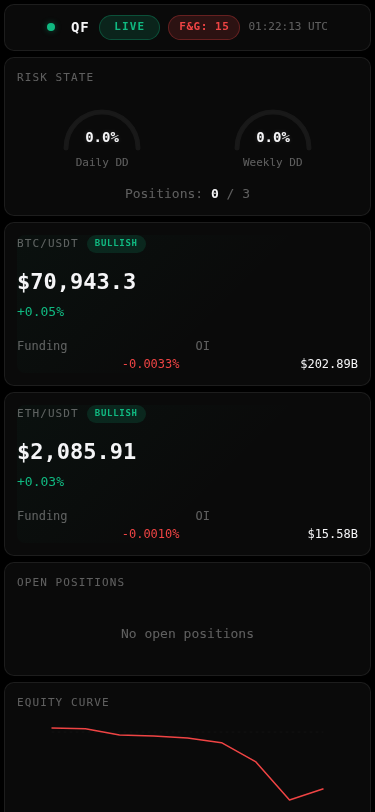

# Algorithmic Crypto Trading System

A production-grade automated trading system that detects **Smart Money Concepts (SMC)** patterns in crypto perpetual futures and executes trades 24/7. Built as a solo project — architecture, strategy, infrastructure, monitoring, and execution all designed and implemented from scratch.

**Live since March 2026** on OKX (BTC-USDT, ETH-USDT perpetual swaps).



---

## Architecture

Five deterministic layers in a single Python process. If **any** layer rejects, the trade does not execute.

```
OKX WebSocket (5m/15m candles, trades, funding)
        │
        ▼
┌─────────────────┐
│  Data Service    │  Real-time market data aggregation
│  (WebSocket +    │  OKX candles, CVD, OI, funding rates
│   REST + APIs)   │  Whale tracking (Etherscan, mempool.space)
└────────┬────────┘
         │  MarketSnapshot (frozen dataclass)
         ▼
┌─────────────────┐
│ Strategy Service │  SMC pattern detection (pure rules, no ML)
│  (Deterministic) │  BOS/CHoCH, Order Blocks, FVG, Liquidity Sweeps
│                  │  Confluence scoring, premium/discount zones
└────────┬────────┘
         │  TradeSetup
         ▼
┌─────────────────┐
│   AI Service     │  Claude API filter (scoring rubric)
│  (Claude Sonnet) │  Currently bypassed — 89.6% approval = no value
└────────┬────────┘
         │  AIDecision
         ▼
┌─────────────────┐
│  Risk Service    │  Non-negotiable guardrails
│  (Stateless)     │  Drawdown limits, position sizing, cooldowns
└────────┬────────┘
         │  RiskApproval
         ▼
┌─────────────────┐
│   Execution      │  OKX order placement via ccxt
│   Service        │  SL/TP lifecycle, breakeven, trailing stop
└─────────────────┘
```

All inter-layer communication uses **typed frozen dataclasses** — no raw dicts cross service boundaries.

---

## How It Detects Trades

The bot looks for institutional footprints in price action using Smart Money Concepts:

### Setup A — Liquidity Sweep + CHoCH + Order Block

The primary setup. Detects when institutions hunt retail stop losses, then reverse:

1. **Liquidity sweep** — price wicks beyond swing high/low, triggering retail stops
2. **CHoCH** (Change of Character) — structure breaks in the opposite direction, confirming reversal
3. **Order Block** — the candle where institutions accumulated. Scored by volume (35%), freshness (30%), proximity (20%), body size (15%)
4. **Entry** at 65% depth into the OB body (Optuna-optimized)
5. **Confluence check** — minimum 2 confirmations required (OB alone = no trade)

### Setup D — LTF CHoCH Scalp

Quick 5-minute setup for scalping:
- CHoCH on 5m + fresh OB near price
- HTF bias + premium/discount alignment required
- 1h entry timeout, 4h max duration
- 75% win rate in backtests

### Rules Applied to All Setups

| Rule | Implementation |
|------|---------------|
| Premium/Discount | Longs only in discount (<50%), shorts only in premium (>50%) |
| Minimum confluences | 2+ required — single signal never triggers a trade |
| SL-too-close filter | `MIN_RISK_DISTANCE_PCT` 0.2% rejects micro-SL trades |
| Dead market filter | `MIN_ATR_PCT` 0.45% skips low-volatility periods |
| Target space | `MIN_TARGET_SPACE_R` 1.4 — requires room to reach TP |


---

## Risk Management

Non-negotiable guardrails enforced before every trade:

| Guardrail | Value |
|-----------|-------|
| Max daily drawdown | 5% |
| Max weekly drawdown | 10% |
| Max open positions | 5 |
| Minimum R:R | 1.2:1 |
| Max leverage | 7x |
| Cooldown after loss | 15 min |
| Max trades/day | 10 |

**Position sizing**: Fixed $20 margin x 7x leverage = $140 notional per trade.

**Exit management**:
- **SL**: Stop-market order (guaranteed fill during crashes)
- **TP**: Limit order at 2:1 R:R (100% close)
- **Breakeven**: Price crosses 1:1 R:R → SL moves to entry
- **Trailing SL**: Price crosses 1.5:1 R:R → SL moves to TP1
- **Max duration**: 12 hours

---

## Backtesting & Optimization

### Backtester (`scripts/backtest.py`)

Replays historical candles through the full strategy pipeline with configurable fill simulation:

```bash
python scripts/backtest.py --days 60                      # Standard replay
python scripts/backtest.py --days 60 --detail             # 1m candle resolution for SL/TP ordering
python scripts/backtest.py --days 60 --fill-prob 0.8      # 80% fill probability
```

The `--detail` flag loads 1-minute candles from PostgreSQL. When a 5m/15m bar contains both SL and TP in its range, it replays 1m sub-candles to determine which was hit first — eliminating the "SL-first bias" common in bar-based backtesting.

### Optuna Optimizer (`scripts/optimize.py`)

Automated hyperparameter tuning with walk-forward validation:

```bash
python scripts/optimize.py --days 60 --trials 100 --metric profit_factor
python scripts/optimize.py --days 60 --trials 50 --walk-forward --jobs 2
```

**10 tunable parameters**: entry depth, OB proximity/distance/age/volume/body thresholds, sweep-CHoCH gap, ATR filter, target space.

Walk-forward splits data 70/30 train/test and validates optimized params against baseline on the unseen test set.

### Results

| Run | Trades | Win Rate | PnL | Profit Factor | Sharpe | Max DD |
|-----|--------|----------|-----|---------------|--------|--------|
| Baseline (60d) | 26 | 42.3% | +$123 | 1.05 | 0.63 | 6.2% |
| Optuna best (30d train) | 17 | 58.8% | +$1,683 | **2.65** | 3.92 | 8.2% |
| Walk-forward test (20d) | 12 | 50.0% | — | **3.07** | — | — |
| Walk-forward baseline | — | — | — | 0.88 | — | — |

Test PF (3.07) > baseline PF (0.88) → **parameters validated, not overfitted**.

Key optimizations applied:
- `SETUP_A_ENTRY_PCT`: 0.50 → 0.65 (shallower entry, higher fill rate)
- `OB_MAX_DISTANCE_PCT`: 0.08 → 0.04 (reject distant OBs — biggest impact)
- `MIN_ATR_PCT`: 0.25% → 0.45% (skip dead markets)


---

## ML Data Pipeline

Every detected setup generates labeled training data for two future models:

1. **Fill probability** — will the limit order get filled?
2. **Trade quality** — if filled, will it be profitable?

~40 features captured **at detection time** (before any downstream decision) to prevent data leakage:
- Setup geometry (entry/SL/TP distances, R:R ratio)
- Decomposed confluences (has_sweep, has_choch, ob_volume_ratio, cvd_aligned, pd_zone)
- Market state (funding rate, OI, CVD, buy dominance %)
- Missingness flags (has_funding, has_oi, has_cvd, has_news, has_whales)

Outcomes tracked: `filled_tp`, `filled_sl`, `filled_trailing`, `filled_timeout`, `unfilled_timeout`, `risk_rejected`, `deduped`

All features and outcomes stored in PostgreSQL (`ml_setups` table) with health metrics streaming to Grafana.

---

## Dashboard

Real-time monitoring built with **Next.js** (frontend) + **FastAPI** (backend).


### What it shows

| Panel | Description |
|-------|-------------|
| **Price panels** | BTC/ETH with % change, HTF bias badge, funding rate, OI |
| **Risk gauge** | Daily/weekly drawdown arcs + open position count |
| **Open positions** | Pending entries + active trades with live P&L |
| **Equity curve** | Cumulative PnL sparkline with win rate and profit factor |
| **Trade log** | Full history with entry, exit reason, P&L |
| **AI decisions** | Confidence rings, approval badges, reasoning (expandable) |
| **Order blocks** | Active OBs sorted by proximity to current price |
| **Liquidation heatmap** | Canvas visualization of estimated long/short liquidation levels |
| **Whale movements** | 24h ETH/BTC large transfers with wallet labels |
| **System health** | Redis, PostgreSQL, API status indicators |

Mobile responsive (375px+) with 3 breakpoints (desktop, tablet, mobile).



---

## Grafana Monitoring

Four pre-provisioned dashboards reading from PostgreSQL:


**Trading Performance** — Equity curve, win rate by setup type, PnL by direction, exit reason distribution, slippage tracking, rolling 7-day win rate

**AI & Risk Analytics** — Approval rate over time, confidence distribution, guardrail trigger frequency, risk event timeline

**System Health** — Service uptime, WebSocket latency, DB query times, memory/CPU usage, candle processing latency

**ML Dataset Health** — Feature completeness, outcome distribution, class balance, missing data timeline

---

## Infrastructure

```
┌─────────────────────────────────────────────────────┐
│  Acer Nitro 5 — Ubuntu Server 24.04 (24/7)         │
│  i5-9300H · 4C/8T · 16GB RAM · 240GB SSD           │
│                                                     │
│  ┌─────────┐  ┌───────┐  ┌─────┐  ┌─────┐  ┌────┐ │
│  │ Bot     │  │  API  │  │ Web │  │ PG  │  │Redis│ │
│  │ main.py │  │ :8000 │  │:3000│  │:5432│  │:6379│ │
│  └─────────┘  └───────┘  └─────┘  └─────┘  └────┘ │
│                                                     │
│  ┌─────────┐                                        │
│  │ Grafana │                                        │
│  │ :3001   │                                        │
│  └─────────┘                                        │
│                                                     │
│  Tailscale VPN → accessible from phone              │
└─────────────────────────────────────────────────────┘
```

All services containerized with Docker Compose. Single `docker-compose up -d` starts everything.

---

## Tech Stack

| Layer | Technology |
|-------|-----------|
| Language | Python 3.12 |
| Exchange | OKX via ccxt (REST + WebSocket) |
| Strategy | pandas, numpy — deterministic rules |
| AI Filter | Claude Sonnet (Anthropic API) |
| Database | PostgreSQL 16 (historical) + Redis 7 (real-time cache) |
| On-chain | Etherscan API (ETH) + mempool.space (BTC) |
| Dashboard | FastAPI + Next.js (TypeScript) |
| Monitoring | Grafana (PostgreSQL datasource) |
| Optimization | Optuna (hyperparameter tuning) |
| Notifications | Telegram (trade alerts, daily summary) |
| Containers | Docker + Docker Compose |
| CI/Testing | pytest (20+ test suites) |

---

## Project Structure

```
quant-fund/
├── main.py                       # Entry point — pipeline orchestration
├── config/settings.py            # Centralized configuration
├── shared/
│   ├── models.py                 # Typed dataclasses (all service interfaces)
│   ├── ml_features.py            # ML feature extraction (~40 features)
│   ├── logger.py                 # Loguru (stdout + daily rotation)
│   └── alert_manager.py          # Telegram alerts
├── data_service/                 # Layer 1: Market data aggregation
│   ├── websocket_feeds.py        # OKX WebSocket (candles + trades)
│   ├── exchange_client.py        # OKX REST via ccxt
│   ├── cvd_calculator.py         # Cumulative Volume Delta
│   ├── oi_flush_detector.py      # OI-based liquidation proxy
│   ├── etherscan_client.py       # ETH whale monitoring
│   ├── btc_whale_client.py       # BTC whale monitoring (UTXO)
│   └── data_store.py             # Redis + PostgreSQL persistence
├── strategy_service/             # Layer 2: SMC pattern detection
│   ├── market_structure.py       # BOS/CHoCH detection
│   ├── order_blocks.py           # OB detection + composite scoring
│   ├── fvg.py                    # Fair Value Gaps
│   ├── liquidity.py              # Pools, sweeps, premium/discount
│   ├── setups.py                 # Setup assembly + confluence engine
│   └── quick_setups.py           # Quick duration setups (D/E)
├── ai_service/                   # Layer 3: Claude API filter
│   ├── claude_client.py          # Anthropic API wrapper
│   └── prompt_builder.py         # Structured context builder
├── risk_service/                 # Layer 4: Guardrails
│   ├── guardrails.py             # Stateless risk checks
│   ├── position_sizer.py         # Size + leverage calculation
│   └── state_tracker.py          # In-memory position state
├── execution_service/            # Layer 5: Order management
│   ├── executor.py               # ccxt order placement
│   ├── monitor.py                # Fill tracking, SL/TP lifecycle
│   └── campaign_monitor.py       # HTF position campaigns
├── scripts/
│   ├── backtest.py               # Historical candle replay
│   └── optimize.py               # Optuna parameter optimizer
├── dashboard/
│   ├── api/                      # FastAPI (15 endpoints + WebSocket)
│   └── web/                      # Next.js (13 components)
├── monitoring/                   # Grafana dashboards + provisioning
├── tests/                        # 20+ test suites
├── docker-compose.yml
└── requirements.txt
```

---

## Key Engineering Decisions

| Decision | Rationale |
|----------|-----------|
| Single process, no message queues | Latency matters — direct function calls are faster than pub/sub for 5 services |
| Frozen dataclasses between layers | Type safety + immutability prevents accidental state mutation |
| Stop-market (not stop-limit) for SL | Stop-limits can skip during crypto flash crashes — guaranteed fill is mandatory |
| OI proxy instead of Binance liquidations | Binance WebSocket geo-blocked from Canada. OI drop >2% in 5min correlates with cascades |
| AI filter bypassed | 89.6% approval rate added latency without filtering value. Code preserved for recalibration |
| Walk-forward validation | Prevents overfitting — test set must outperform baseline, not just training set |
| Fixed $20 margin | Simple, predictable sizing at micro-scale. Percentage mode available for scaling |
| 1m detail mode in backtester | Solves the "which hit first" problem when SL and TP are both in the same bar |

---

## Running Tests

```bash
source venv/bin/activate
python -m pytest tests/ -v --tb=short
```

Coverage includes: market structure detection, order block scoring, FVG identification, liquidity sweeps, setup assembly, risk guardrails, position sizing, AI prompt building, execution flow, ML feature extraction.

---

## Disclaimer

This is a personal research and learning project. Not financial advice. Crypto trading with leverage carries significant risk of loss. Past backtest results do not guarantee future performance.
